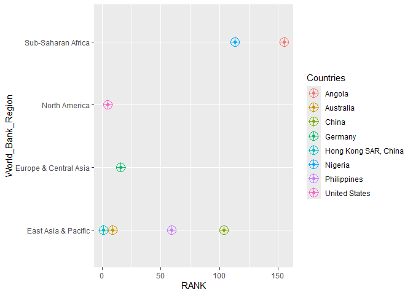
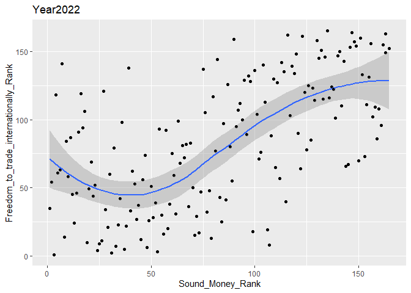
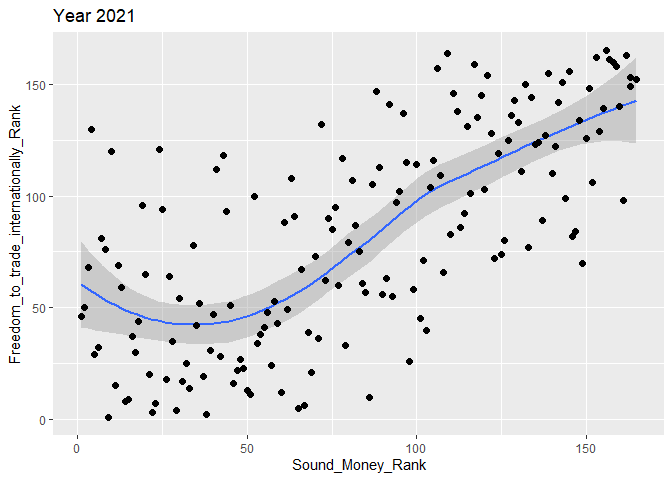
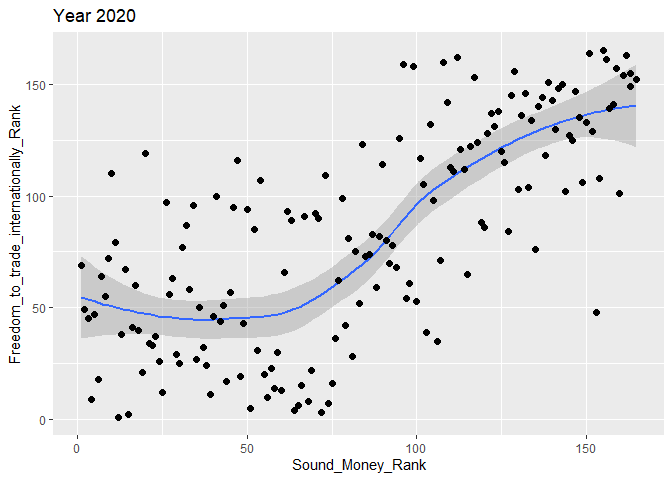
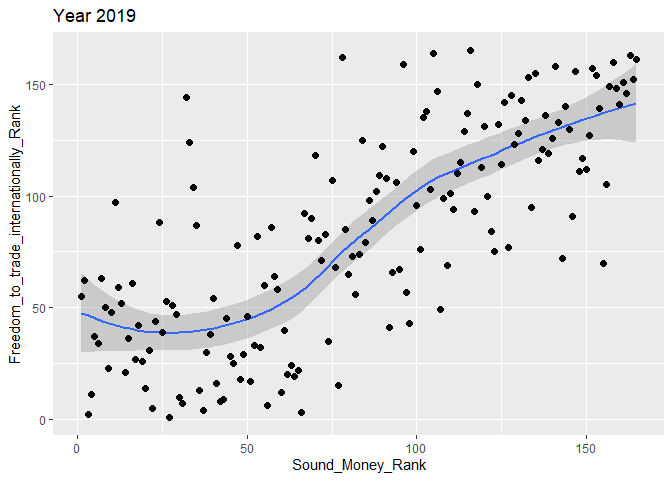
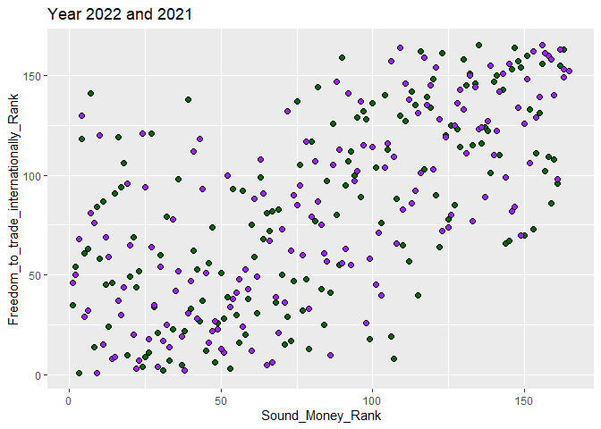
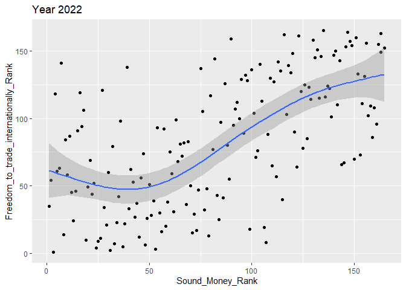
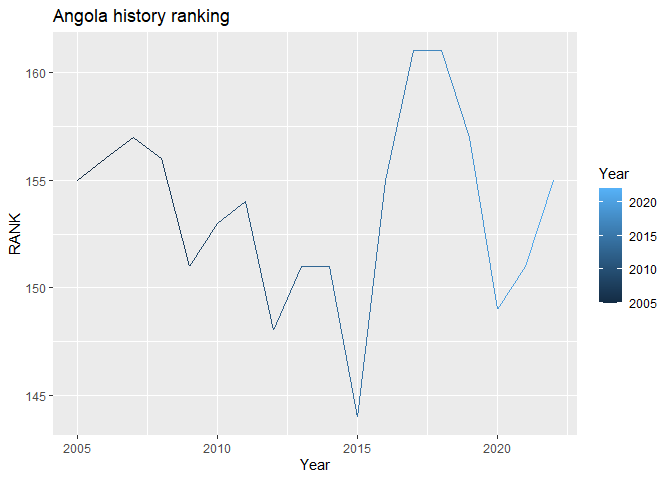

# Data Visualization Project 01
---
title: "Data Visualization Mini-Project 1"
author: "Sidney Ang"
date: "2025-05-29"
output: html_document
---

This assignment is intended to demonstrate some of skills you have learned in the course so far, and to put into practice the principles of data visualization you have explored in the different provided materials.

testing


``` r
installed.packages("rnaturalearth")
```

```
##      Package LibPath Version Priority Depends Imports LinkingTo Suggests
##      Enhances License License_is_FOSS License_restricts_use OS_type Archs
##      MD5sum NeedsCompilation Built
```

``` r
installed.packages("rnaturalearthdata")
```

```
##      Package LibPath Version Priority Depends Imports LinkingTo Suggests
##      Enhances License License_is_FOSS License_restricts_use OS_type Archs
##      MD5sum NeedsCompilation Built
```


``` r
library(readxl)
```

```
## Warning: package 'readxl' was built under R version 4.4.3
```

``` r
library(tidyverse)
```

```
## Warning: package 'ggplot2' was built under R version 4.4.3
```

```
## Warning: package 'purrr' was built under R version 4.4.3
```

```
## ── Attaching core tidyverse packages ──────────────────────── tidyverse 2.0.0 ──
## ✔ dplyr     1.1.4     ✔ readr     2.1.5
## ✔ forcats   1.0.0     ✔ stringr   1.5.1
## ✔ ggplot2   3.5.2     ✔ tibble    3.2.1
## ✔ lubridate 1.9.4     ✔ tidyr     1.3.1
## ✔ purrr     1.0.4     
## ── Conflicts ────────────────────────────────────────── tidyverse_conflicts() ──
## ✖ dplyr::filter() masks stats::filter()
## ✖ dplyr::lag()    masks stats::lag()
## ℹ Use the conflicted package (<http://conflicted.r-lib.org/>) to force all conflicts to become errors
```

``` r
library(dplyr)
```


``` r
Project_mini <- index_score_clean_second_pass <- read_excel("C:/Data Visualization Mini-Project 1/data/index score -clean second pass.xlsx")

View(Project_mini)
dim(Project_mini)
```

```
## [1] 4786   11
```

``` r
Project_mini
```

```
## # A tibble: 4,786 × 11
##     Year Countries    Economic Freedom Summary …¹  RANK Money_growth Sound_Money
##    <dbl> <chr>                              <dbl> <dbl>        <dbl>       <dbl>
##  1  2022 Albania                             7.48    38         9.48        8.76
##  2  2022 Algeria                             4.46   161         8.68        6.37
##  3  2022 Angola                              4.79   155         7.52        5.00
##  4  2022 Argentina                           4.55   159         0           2.55
##  5  2022 Armenia                             7.49    36         8.54        8.47
##  6  2022 Australia                           7.98     9         8.70        8.80
##  7  2022 Austria                             7.62    23         7.77        8.44
##  8  2022 Azerbaijan                          5.8    128         7.61        6.25
##  9  2022 Bahamas, The                        6.65    81         8.96        6.08
## 10  2022 Bahrain                             7.51    34         9.94        9.03
## # ℹ 4,776 more rows
## # ℹ abbreviated name: ¹​`Economic Freedom Summary Index`
## # ℹ 5 more variables: Sound_Money_Rank <dbl>,
## #   Freedom_to_trade_internationally <dbl>,
## #   Freedom_to_trade_internationally_Rank <dbl>, World_Bank_Region <chr>,
## #   `World Bank Current Income Classification, 1990-Present` <chr>
```

``` r
year2022 <- Project_mini %>% 
  filter(Year== "2022")
year2022
```

```
## # A tibble: 165 × 11
##     Year Countries    Economic Freedom Summary …¹  RANK Money_growth Sound_Money
##    <dbl> <chr>                              <dbl> <dbl>        <dbl>       <dbl>
##  1  2022 Albania                             7.48    38         9.48        8.76
##  2  2022 Algeria                             4.46   161         8.68        6.37
##  3  2022 Angola                              4.79   155         7.52        5.00
##  4  2022 Argentina                           4.55   159         0           2.55
##  5  2022 Armenia                             7.49    36         8.54        8.47
##  6  2022 Australia                           7.98     9         8.70        8.80
##  7  2022 Austria                             7.62    23         7.77        8.44
##  8  2022 Azerbaijan                          5.8    128         7.61        6.25
##  9  2022 Bahamas, The                        6.65    81         8.96        6.08
## 10  2022 Bahrain                             7.51    34         9.94        9.03
## # ℹ 155 more rows
## # ℹ abbreviated name: ¹​`Economic Freedom Summary Index`
## # ℹ 5 more variables: Sound_Money_Rank <dbl>,
## #   Freedom_to_trade_internationally <dbl>,
## #   Freedom_to_trade_internationally_Rank <dbl>, World_Bank_Region <chr>,
## #   `World Bank Current Income Classification, 1990-Present` <chr>
```
Investigate another dataset from year 2021.


``` r
year2021 <- Project_mini %>% filter(Year== "2021")
year2021
```

```
## # A tibble: 165 × 11
##     Year Countries    Economic Freedom Summary …¹  RANK Money_growth Sound_Money
##    <dbl> <chr>                              <dbl> <dbl>        <dbl>       <dbl>
##  1  2021 Albania                             7.58    30         9.61        9.45
##  2  2021 Algeria                             4.77   157         8.92        6.94
##  3  2021 Angola                              5.17   151         7.50        4.70
##  4  2021 Argentina                           4.55   160         1.35        2.96
##  5  2021 Armenia                             7.52    33         8.35        8.65
##  6  2021 Australia                           8        8         8.82        9.33
##  7  2021 Austria                             7.67    26         6.97        8.93
##  8  2021 Azerbaijan                          6.12   111         8.12        7.68
##  9  2021 Bahamas, The                        6.43    94         9.05        6.36
## 10  2021 Bahrain                             7.55    31         9.94        9.36
## # ℹ 155 more rows
## # ℹ abbreviated name: ¹​`Economic Freedom Summary Index`
## # ℹ 5 more variables: Sound_Money_Rank <dbl>,
## #   Freedom_to_trade_internationally <dbl>,
## #   Freedom_to_trade_internationally_Rank <dbl>, World_Bank_Region <chr>,
## #   `World Bank Current Income Classification, 1990-Present` <chr>
```


``` r
year2020 <- Project_mini %>% 
  filter(Year== "2020")
year2020
```

```
## # A tibble: 165 × 11
##     Year Countries    Economic Freedom Summary …¹  RANK Money_growth Sound_Money
##    <dbl> <chr>                              <dbl> <dbl>        <dbl>       <dbl>
##  1  2020 Albania                             7.57    30         9.69        9.68
##  2  2020 Algeria                             4.92   156         9.39        7.85
##  3  2020 Angola                              5.31   149         6.53        4.85
##  4  2020 Argentina                           4.5    160         1.70        3.27
##  5  2020 Armenia                             7.55    31         8.16        9.34
##  6  2020 Australia                           8.07     7         8.82        9.46
##  7  2020 Austria                             7.58    29         5.95        8.80
##  8  2020 Azerbaijan                          6.16   110         8.86        8.41
##  9  2020 Bahamas, The                        6.56    89         8.65        6.56
## 10  2020 Bahrain                             7.44    41         9.94        9.31
## # ℹ 155 more rows
## # ℹ abbreviated name: ¹​`Economic Freedom Summary Index`
## # ℹ 5 more variables: Sound_Money_Rank <dbl>,
## #   Freedom_to_trade_internationally <dbl>,
## #   Freedom_to_trade_internationally_Rank <dbl>, World_Bank_Region <chr>,
## #   `World Bank Current Income Classification, 1990-Present` <chr>
```


``` r
year2019 <- Project_mini %>% 
  filter(Year== "2019")
year2019
```

```
## # A tibble: 165 × 11
##     Year Countries    Economic Freedom Summary …¹  RANK Money_growth Sound_Money
##    <dbl> <chr>                              <dbl> <dbl>        <dbl>       <dbl>
##  1  2019 Albania                             7.69    35         9.84        9.76
##  2  2019 Algeria                             4.74   159         9.85        8.00
##  3  2019 Angola                              5.03   157         7.25        3.71
##  4  2019 Argentina                           5.16   155         3.06        3.37
##  5  2019 Armenia                             7.68    36         8.28        9.34
##  6  2019 Australia                           8.21     8         9.16        9.42
##  7  2019 Austria                             7.88    24         7.96        9.30
##  8  2019 Azerbaijan                          6.37   106         9.15        8.45
##  9  2019 Bahamas, The                        7.02    74         8.98        7.97
## 10  2019 Bahrain                             7.48    48         9.94        9.29
## # ℹ 155 more rows
## # ℹ abbreviated name: ¹​`Economic Freedom Summary Index`
## # ℹ 5 more variables: Sound_Money_Rank <dbl>,
## #   Freedom_to_trade_internationally <dbl>,
## #   Freedom_to_trade_internationally_Rank <dbl>, World_Bank_Region <chr>,
## #   `World Bank Current Income Classification, 1990-Present` <chr>
```


Data wrangle counting how many countries are located in each region.


``` r
countries_region <- Project_mini %>%
  filter(Year == 2022) %>% 
   group_by(World_Bank_Region) %>% 
  summarise(total = n())
countries_region
```

```
## # A tibble: 7 × 2
##   World_Bank_Region             total
##   <chr>                         <int>
## 1 East Asia & Pacific              21
## 2 Europe & Central Asia            47
## 3 Latin America & the Caribbean    26
## 4 Middle East & North Africa       19
## 5 North America                     2
## 6 South Asia                        6
## 7 Sub-Saharan Africa               44
```


Make the data easily manage by data wrangling by filtering only the Year 2022 in the data frame.


``` r
my_df_year <- Project_mini %>% 
  filter(Year %in% c(2022), Countries %in% c("Angola", "Australia", "Philippines", "Nigeria","China", "Germany", "United States", "Hong Kong SAR, China"))
view(my_df_year)
my_df_year
```

```
## # A tibble: 8 × 11
##    Year Countries          Economic Freedom Sum…¹  RANK Money_growth Sound_Money
##   <dbl> <chr>                               <dbl> <dbl>        <dbl>       <dbl>
## 1  2022 Angola                               4.79   155         7.52        5.00
## 2  2022 Australia                            7.98     9         8.70        8.80
## 3  2022 China                                6.14   104         9.36        8.25
## 4  2022 Germany                              7.8     16         7.76        8.60
## 5  2022 Hong Kong SAR, Ch…                   8.58     1         9.35        9.53
## 6  2022 Nigeria                              5.96   113         7.88        7.46
## 7  2022 Philippines                          7.01    59         9.22        9.04
## 8  2022 United States                        8.09     5         8.28        8.53
## # ℹ abbreviated name: ¹​`Economic Freedom Summary Index`
## # ℹ 5 more variables: Sound_Money_Rank <dbl>,
## #   Freedom_to_trade_internationally <dbl>,
## #   Freedom_to_trade_internationally_Rank <dbl>, World_Bank_Region <chr>,
## #   `World Bank Current Income Classification, 1990-Present` <chr>
```

Next, we select a few columns that we like to see and investigate.


``` r
j1 <- ggplot(my_df_year, mapping = aes(y = World_Bank_Region, x = RANK, color = Countries))

j1 + geom_point() + geom_point(size = 5, shape = 10)
```

<!-- -->

Using ggplot to visually check the data.


``` r
w1 <- ggplot(year2022, mapping = aes(x = Sound_Money_Rank,
                                   y = Freedom_to_trade_internationally_Rank, Countries = "Angola")) + geom_point() + geom_smooth(method = "loess") + ggtitle("Year2022") + geom_point(fill = "black", color = "black", size = 1, shape = 21)
w1
```

```
## `geom_smooth()` using formula = 'y ~ x'
```

<!-- -->


``` r
w2 <- ggplot(year2021, mapping = aes(x = Sound_Money_Rank,
                                   y = Freedom_to_trade_internationally_Rank)) + geom_point() + geom_smooth(method = "loess") + ggtitle("Year 2021") + geom_point(fill = "black", color = "black", size = 2, shape = 21)
w2
```

```
## `geom_smooth()` using formula = 'y ~ x'
```

<!-- -->


``` r
w3 <- ggplot(year2020, mapping = aes(x = Sound_Money_Rank,
                                   y = Freedom_to_trade_internationally_Rank)) + geom_point() + geom_smooth(method = "loess")+ ggtitle("Year 2020") + geom_point(fill = "black", color = "black", size = 2, shape = 21)
w3
```

```
## `geom_smooth()` using formula = 'y ~ x'
```

<!-- -->
 

``` r
w4 <- ggplot(year2019, mapping = aes(x = Sound_Money_Rank,
                                   y = Freedom_to_trade_internationally_Rank)) + geom_point() + geom_smooth(method = "loess") + ggtitle("Year 2019") +geom_point(fill = "Black", color = "black", size = 2, shape = 21)
w4
```

```
## `geom_smooth()` using formula = 'y ~ x'
```

<!-- -->


``` r
ggplot() +
  geom_point(data = year2022, aes(x = Sound_Money_Rank,
                                   y = Freedom_to_trade_internationally_Rank), 
             fill = "dark green", color = "black", size = 2, shape = 21) + 
  geom_point(data = year2021, aes(x = Sound_Money_Rank,
                                   y = Freedom_to_trade_internationally_Rank), fill = "purple", color = "black", size = 2, shape = 21) + ggtitle("Year 2022 and 2021")
```

<!-- -->

``` r
b1 <- ggplot(data = year2022, aes(x = Sound_Money_Rank,
                                   y = Freedom_to_trade_internationally_Rank), 
             fill = "Blue", color = RANK, size = 2, shape = 21)
b1 + geom_point() + geom_smooth(method = "gam") + ggtitle("Year 2022")
```

```
## `geom_smooth()` using formula = 'y ~ s(x, bs = "cs")'
```

<!-- -->


``` r
h <- Project_mini %>% 
  filter(Year %in% c(1970:2022), Countries == "Angola") %>% na.omit(Project_mini)
h
```

```
## # A tibble: 18 × 11
##     Year Countries Economic Freedom Summary Ind…¹  RANK Money_growth Sound_Money
##    <dbl> <chr>                              <dbl> <dbl>        <dbl>       <dbl>
##  1  2022 Angola                              4.79   155        7.52       5.00  
##  2  2021 Angola                              5.17   151        7.50       4.70  
##  3  2020 Angola                              5.31   149        6.53       4.85  
##  4  2019 Angola                              5.03   157        7.25       3.71  
##  5  2018 Angola                              4.34   161        7.82       3.32  
##  6  2017 Angola                              4.41   161        8.36       4.39  
##  7  2016 Angola                              5.04   155        8.91       4.72  
##  8  2015 Angola                              5.25   144        8.42       6.21  
##  9  2014 Angola                              4.79   151        8.95       6.55  
## 10  2013 Angola                              4.84   151        8.88       6.26  
## 11  2012 Angola                              4.96   148        5.94       5.32  
## 12  2011 Angola                              4.69   154        4.18       4.60  
## 13  2010 Angola                              4.85   153        3.29       4.39  
## 14  2009 Angola                              4.68   151        0.681      3.52  
## 15  2008 Angola                              4.11   156        0          3.57  
## 16  2007 Angola                              3.99   157        0.540      2.66  
## 17  2006 Angola                              4.04   156        0          2.58  
## 18  2005 Angola                              3.68   155        0          0.0243
## # ℹ abbreviated name: ¹​`Economic Freedom Summary Index`
## # ℹ 5 more variables: Sound_Money_Rank <dbl>,
## #   Freedom_to_trade_internationally <dbl>,
## #   Freedom_to_trade_internationally_Rank <dbl>, World_Bank_Region <chr>,
## #   `World Bank Current Income Classification, 1990-Present` <chr>
```


``` r
Angola_line_of_progress <- ggplot(data = h, mapping = aes(x = Year, y = RANK))
Angola_line_of_progress <- Angola_line_of_progress + geom_line(aes(color=Year))
Angola_line_of_progress + ggtitle("Angola history ranking")
```

<!-- -->


_revised version of mini-project 01 goes here_
